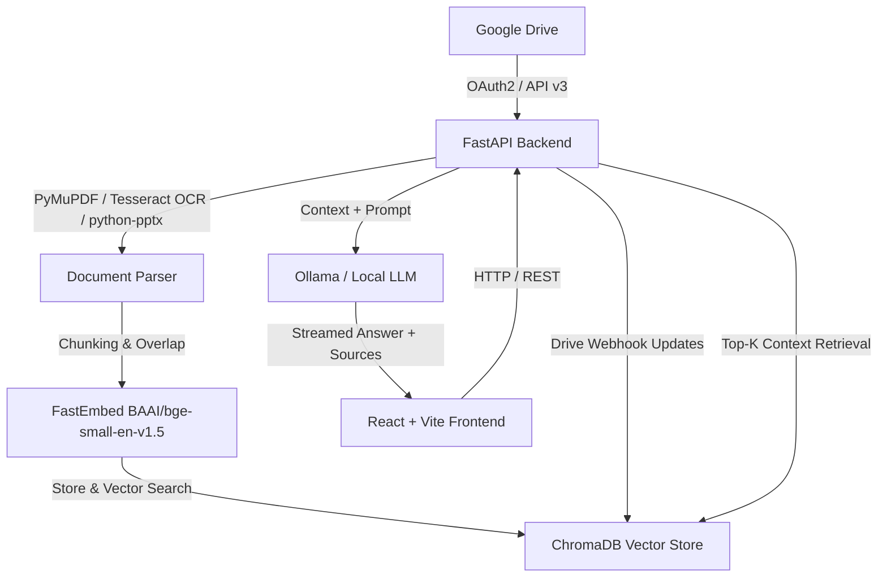

# Google Drive RAG System

A full-stack, privacy-focused Retrieval-Augmented Generation (RAG) system that connects directly to **Google Drive**, ingests and parses documents (PDFs, scanned images, PowerPoint presentations), indexes them into a local vector database (**ChromaDB**), and answers questions using a local LLM (**Ollama**).

---

## Architecture Overview



---

## Features

- **Google Drive Integration**: Connect via Google OAuth2, browse folders, and recursively index contents.
- **Multi-Format Parsing**:
  - **PDFs**: Fast text extraction via `PyMuPDF` (`fitz`). Automatic fallback to `Tesseract OCR` for scanned documents.
  - **Images**: OCR processing for `.png`, `.jpg`, `.jpeg` files using Tesseract.
  - **PowerPoint**: Slide-by-slide text extraction using `python-pptx`.
- **Vector Search**: Local vector storage with `ChromaDB` using `FastEmbed` (`BAAI/bge-small-en-v1.5`).
- **Local LLM Answers**: RAG pipeline powered by `Ollama` (`qwen3:8b`, `llama3`, or configurable local models) to ensure data privacy.
- **Real-Time Sync**: Supports Google Drive push notifications / webhooks (`/drive-webhook`) to automatically re-index modified files.
- **Containerized Deployment**: Ready to deploy with `Docker` and `Docker Compose`.

---

## Tech Stack

### Backend
- **Framework**: FastAPI (Python 3.11) & Uvicorn
- **Vector Database**: ChromaDB
- **Embeddings**: FastEmbed (`BAAI/bge-small-en-v1.5`)
- **Document Extractors**: PyMuPDF, PyTesseract (Tesseract OCR), Pillow, python-pptx
- **Google Client**: `google-api-python-client`, `google-auth-oauthlib`

### Frontend
- **Framework**: React 19 + Vite
- **Routing**: React Router v7
- **HTTP Client**: Axios

### Infrastructure
- **Containerization**: Docker (Multi-stage builds) & Docker Compose
- **Web Server**: Nginx (serving static production frontend assets)

---

## Directory Structure

```text
gdrive-rag-system/
├── backend/
│   ├── app/
│   │   ├── api/          # Route handlers (auth, drive, query)
│   │   ├── models/       # Pydantic schemas
│   │   └── services/     # Core services (gdrive, parser, chunker, vectorstore, rag)
│   ├── config.py         # Application configuration & env settings
│   ├── main.py           # FastAPI entrypoint
│   ├── requirements.txt  # Python package requirements
│   └── Dockerfile        # Backend Docker image (Python 3.11 + Tesseract OCR)
├── frontend/
│   ├── src/              # React components & pages
│   ├── public/           # Static assets
│   ├── nginx.conf        # Nginx configuration for React SPA
│   ├── package.json      # Node.js dependencies
│   └── Dockerfile        # Frontend Docker image (Node build + Nginx static server)
├── docker-compose.yml    # Container orchestration configuration
└── README.md             # Project documentation
```

---

## Prerequisites

Before running the application, make sure you have installed:

1. **Docker & Docker Compose** (for containerized setup)
2. **Node.js 20+** & **Python 3.11+** (for manual local development)
3. **Ollama** installed and running locally with your desired model:
   ```bash
   ollama pull qwen3:8b
   ```
4. **Google Cloud OAuth Credentials**:
   - Create a project in [Google Cloud Console](https://console.cloud.google.com/).
   - Enable the **Google Drive API**.
   - Create **OAuth 2.0 Client IDs** (Web Application).
   - Set Redirect URI to `http://localhost:8000/api/auth/google/callback`.

---

## Quick Start (Docker Compose)

The easiest way to run the entire stack is using Docker Compose.

1. **Clone the repository**:
   ```bash
   git clone https://github.com/your-org/gdrive-rag-system.git
   cd gdrive-rag-system
   ```

2. **Configure Environment Variables**:
   Create or update `backend/.env`:
   ```env
   APP_NAME="Google Drive RAG API"
   APP_VERSION="1.0.0"
   CHROMA_DB_PATH="/app/data/chroma_db"
   OLLAMA_BASE_URL="http://host.docker.internal:11434"
   OLLAMA_MODEL="qwen3:8b"
   EMBEDDING_MODEL="BAAI/bge-small-en-v1.5"
   CHUNK_SIZE=1000
   CHUNK_OVERLAP=150
   TOP_K=5

   GOOGLE_CLIENT_ID="YOUR_GOOGLE_CLIENT_ID"
   GOOGLE_CLIENT_SECRET="YOUR_GOOGLE_CLIENT_SECRET"
   GOOGLE_REDIRECT_URI="http://localhost:8000/api/auth/google/callback"
   SESSION_SECRET="your_random_session_secret_key"
   ```

3. **Start services**:
   ```bash
   docker compose up --build
   ```

4. **Access the Application**:
   - **Frontend App**: [http://localhost:5173](http://localhost:5173)
   - **Backend API Docs**: [http://localhost:8000/docs](http://localhost:8000/docs)

---

## Manual Local Development

If you prefer to run the backend and frontend directly on your local machine:

### 1. Backend Setup

```bash
cd backend

# Create virtual environment
python3 -m venv .venv
source .venv/bin/activate

# Install dependencies
pip install -r requirements.txt

# Ensure Tesseract OCR is installed on your OS
# Ubuntu/Debian: sudo apt install tesseract-ocr poppler-utils
# macOS: brew install tesseract poppler

# Run FastAPI server
uvicorn main:app --reload --port 8000
```

### 2. Frontend Setup

```bash
cd frontend

# Install npm dependencies
npm install

# Start Vite development server
npm run dev
```

The frontend will start at `http://localhost:5173`.

---

## Configuration & Environment Settings

The backend configuration is managed by `config.py` using `pydantic-settings`:

| Variable | Default Value | Description |
| :--- | :--- | :--- |
| `APP_NAME` | `"Google Drive RAG API"` | FastAPI application name |
| `CHROMA_DB_PATH` | `"./data/chroma_db"` | Path to persistent ChromaDB storage |
| `OLLAMA_BASE_URL` | `"http://localhost:11434"` | Ollama API base endpoint |
| `OLLAMA_MODEL` | `"qwen3:8b"` | Model used for RAG generation |
| `EMBEDDING_MODEL` | `"BAAI/bge-small-en-v1.5"` | Embedding model for FastEmbed |
| `CHUNK_SIZE` | `1000` | Character chunk size for indexing |
| `CHUNK_OVERLAP` | `150` | Character overlap between adjacent chunks |
| `TOP_K` | `5` | Number of context chunks retrieved per query |
| `GOOGLE_CLIENT_ID` | `""` | Google OAuth Client ID |
| `GOOGLE_CLIENT_SECRET` | `""` | Google OAuth Client Secret |
| `GOOGLE_REDIRECT_URI` | `http://localhost:8000/api/auth/google/callback` | OAuth redirect URI |

---

## API Endpoints Reference

### Health & Root
- `GET /`: Returns API status.
- `GET /health`: Health check endpoint.

### Google OAuth Flow
- `GET /api/auth/google`: Initiates Google OAuth2 login flow.
- `GET /api/auth/google/callback`: OAuth2 callback handler.

### Drive Operations
- `POST /drive/sync`: Ingests files recursively from a Google Drive folder ID.
- `POST /drive-webhook`: Webhook listener for Google Drive file change notifications.

### RAG Queries
- `POST /query`: Submits a question and returns an AI-generated answer along with document source metadata.

---

## License

This project is open source and available under the [MIT License](LICENSE).
